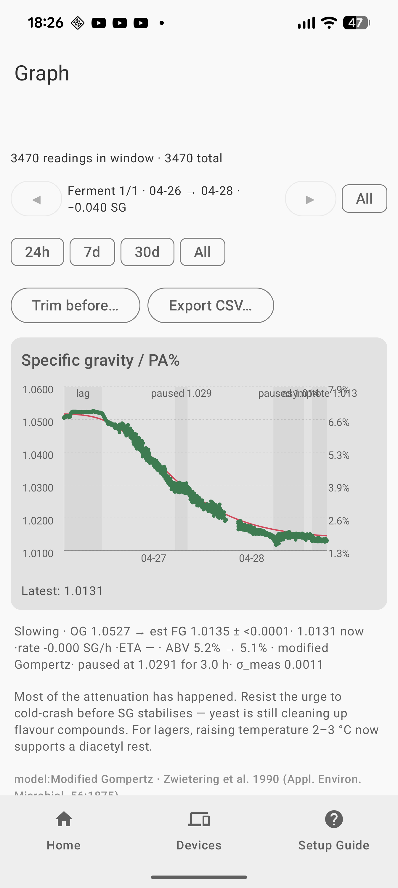
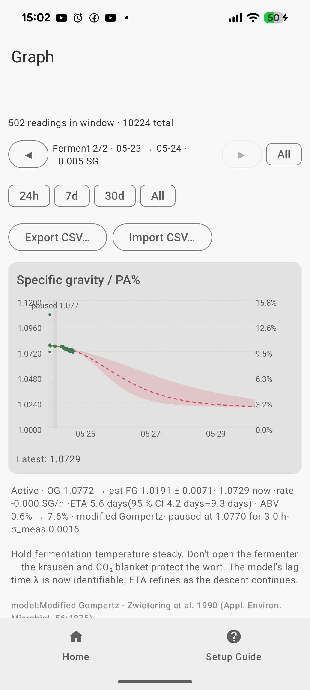

# iSpindle Plotter

[](https://github.com/GlassOnTin/iSpindlePlotter/actions/workflows/build.yml)
[](https://github.com/GlassOnTin/iSpindlePlotter/releases)
[](LICENSE)

Android app (Kotlin / Jetpack Compose) that receives, stores, plots and
calibrates readings from an [iSpindel](https://github.com/universam1/iSpindel)
hydrometer — including the **MTB iSpindel PCB 4.0**.

<p align="center">
  
</p>

<p align="center">
  
  <br>
  <em>A live brew about a day in — the ferment picker (<code>Ferment 2/2</code>) isolates the
  current run, the phase reads <code>Active</code> while the descent is barely under way, and the
  model projects FG and ETA with an honest credible band that tightens as data accumulates.</em>
</p>

> **Protocol note.** The MTB PCB 4.0 uses an ESP8266 and therefore has no
> Bluetooth. "Pairing" with it is really a WiFi / HTTP handshake: the phone
> runs an HTTP server, the iSpindle wakes on its interval and POSTs JSON,
> then deep-sleeps. This app is built around that flow.

## Download

Grab the latest `app-debug.apk` (or signed release APK) from the
[releases page](https://github.com/GlassOnTin/iSpindlePlotter/releases),
or install from source below.

## Features

- HTTP server in a foreground service — listens for the iSpindel "Generic
  HTTP" JSON payload (`name`, `ID`, `angle`, `temperature`, `battery`,
  `RSSI`, etc.) on port **9501**.
- Automatic device discovery — each unique firmware `ID` becomes a device.
- Time-series graphs of tilt angle, temperature, specific gravity and
  battery voltage, with 24 h / 7 d / 30 d / all windows.
- Calibration: add `(angle, known SG)` points, fit a polynomial of degree
  1–3 by ordinary least squares, see R², apply the fit to live readings.
- Bayesian fermentation model — 4-parameter modified-Gompertz SG curve
  ([Zwietering et al. 1990](https://doi.org/10.1128/aem.56.6.1875-1881.1990))
  fitted by Levenberg–Marquardt with a Gaussian prior on attenuation
  (MAP), Laplace approximation of the posterior, and a 95 % credible
  band on both the predicted SG curve and the time-to-FG. The Gompertz
  asymmetry naturally accommodates the long flat lag and slow asymptotic
  tail of real beer fermentation. See [`ROADMAP.md`](ROADMAP.md) for
  what the fitter does today and where it's going.
- Plateau detection — flags lag plateaus, mid-ferment diauxic shifts
  (where yeast pauses between sugar populations), and asymptote tails
  on the SG chart with a shaded band and inline label.
- Phase classifier — Lag / Active / Slowing / Conditioning / Stuck.
  "Conditioning" replaces a misleading "Complete": when SG drops below
  the iSpindle's noise floor the ferment is usually still biologically
  active (yeast scrubbing diacetyl, finishing maltotriose, CO₂
  desorbing), and the label points the brewer at the right next steps.
- Battery health chart — lithium-ion 18650 voltage zones (full / low /
  critical) shaded behind the discharge trend, axis locked to the
  3.0–4.2 V cell window. Linear-regression smoother with a Gaussian
  jitter cloud over the raw points.
- Localised in 10 languages: Arabic, Bengali, Chinese (Simplified),
  English, French, German, Hindi, Japanese, Portuguese, Russian,
  Spanish. Follows the system locale.
- Room-backed storage, so readings persist across app restarts.
- Optional **buffering proxy** — point the iSpindle at a tiny always-on
  proxy (a single static Go binary that runs on a Pi, NAS, or OpenWrt
  router) so readings survive while your phone is off or away. The app
  discovers it on the LAN via mDNS and pulls everything it missed. See
  [`proxy/`](proxy/) and the section below.

## Build from source

Prerequisites: **Android SDK 34+** and **JDK 17+** (project targets JVM 17;
JDK 21 works fine).

```
git clone https://github.com/GlassOnTin/iSpindlePlotter.git
cd iSpindlePlotter
./gradlew :app:assembleDebug
./gradlew :app:installDebug    # with a connected device or emulator
```

Open in Android Studio / IntelliJ and the wrapper + SDK bootstrap happens
automatically.

## Continuous builds

- `build` workflow runs on every push and PR — produces an `app-debug.apk`
  as a workflow artifact.
- `release` workflow runs on a `v*` tag — creates a GitHub Release and
  attaches an APK. By default the APK is **debug-signed** so it installs
  without a vendor keystore. To ship a properly-signed release, add these
  repository secrets and push a tag:
  - `RELEASE_KEYSTORE_BASE64` — base64-encoded JKS keystore
  - `RELEASE_KEYSTORE_PASSWORD`
  - `RELEASE_KEY_ALIAS`
  - `RELEASE_KEY_PASSWORD`
  When those secrets are present the workflow switches to
  `./gradlew :app:assembleRelease`.

## Pair with the iSpindle

1. On the **Home** tab, tap **Start**. A persistent notification confirms
   the server is listening; the tab shows the phone's current IP.
2. Put the iSpindle in config mode: hold it horizontally at power-on for
   ~20 s. It raises an AP named `iSpindel`.
3. Connect the phone to that AP, open `http://192.168.4.1/` in a browser.
4. In the iSpindle config portal set:
   - **WiFi SSID / password** of your home network
   - **Service Type** = HTTP
   - **Server Address** = the phone IP shown on Home
   - **Server Port** = `9501`
   - **URI** = `/` (or leave default — any path is accepted)
   - **Sample Interval** = `60` seconds for initial testing
5. Save. The iSpindle reboots, joins WiFi, wakes, POSTs, sleeps.
6. Reconnect the phone to the same home WiFi. Within one interval the
   first reading appears on **Home**.

Phone and iSpindle must share a subnet. If your router isolates guest
WiFi or uses AP isolation, turn it off for the iSpindle's SSID. DHCP lease
changes on the phone will break reception — reserve the phone's MAC in
the router for a static address, **or** use the buffering proxy below,
which lives at a stable address and removes the phone-IP dependency.

## Buffering proxy (optional)

The iSpindle has no retry: it wakes, POSTs once, and deep-sleeps. If the
phone is off, asleep, or off-network at that moment, the reading is lost.
The optional proxy is an always-on collector that buffers every reading so
the phone can catch up whenever it's next online.

```
iSpindle ──POST──▶ proxy (always-on) ──append──▶ readings.jsonl
                      ▲                               │
                      └──GET /readings?since=N────────┘ ◀── phone app
```

- **Run it** on any always-on box — a Raspberry Pi, a NAS, or an OpenWrt
  router. It's a single static Go binary (stdlib + mDNS, no database) with
  `systemd` and OpenWrt `procd` init scripts. Build and install steps are
  in [`proxy/README.md`](proxy/README.md).
- **Point the iSpindle** at the proxy's `host:9501` instead of the phone —
  the same Generic-HTTP settings as above. The app's Configure flow fills
  this in for you once proxy mode is on.
- **Enable in the app**: **Setup → Use buffering proxy**. Leave the URL
  blank and the app finds the proxy automatically over mDNS
  (`_ispindle-proxy._tcp`); or type `http://host:9501` to pin it. The graph
  then auto-refreshes as the app pulls — every ~2 minutes, plus immediately
  when you bring the app to the foreground.

LAN-only by design — no auth, no TLS. To collect readings while away from
home, reach the proxy through your router's VPN (e.g. WireGuard) rather
than forwarding a port.

## Calibrate

The iSpindle measures **tilt angle**, not gravity. You fit a polynomial
`SG = a + b·angle + c·angle² + d·angle³` per device from reference
solutions of known SG:

1. Float the iSpindle in distilled water at 20 °C. Let it settle through
   one reading cycle, read the angle from the Home tab, tap the device
   on the **Devices** tab → **Calibrate**, tap **Use this** to pre-fill
   the angle, enter `1.000` as the SG, Add.
2. Mix sugar + water, measure SG with a refractometer or hydrometer,
   float, record the iSpindle's angle, add another point.
3. Repeat across the SG range you care about (1.000 → 1.080 for typical
   beer / cider). Three points is the minimum for a quadratic fit; four
   or five give R² > 0.999 in practice.
4. Tap **Fit & save**. The polynomial is applied to every future reading
   — the Home tab and Graph tab will now show SG alongside angle.

Reference-solution table (approx., 20 °C):

| table sugar g / 100 g water | SG     |
| --------------------------- | ------ |
| 0                           | 1.000  |
| 5                           | 1.020  |
| 10                          | 1.040  |
| 15                          | 1.060  |
| 20                          | 1.080  |

Always verify with a hydrometer; sugar purity varies.

## What is **not** verified

- This has been written from spec only — it has **not** been built or
  tested against a physical iSpindle on this machine. Treat the first
  run as a smoke test.
- Ktor 3.0 server API on Android (CIO engine) is known to work but the
  first run on very old Android devices may surface Netty / SLF4J
  classloader warnings — these are benign.
- BLE is **not** supported. If you later upgrade the board to an ESP32
  variant with BLE support in firmware, this app would need a new
  transport module.

## Project layout

```
app/src/main/
├── AndroidManifest.xml
├── kotlin/com/ispindle/plotter/
│   ├── IspindleApp.kt            # Application + manual DI
│   ├── MainActivity.kt
│   ├── calibration/              # Polynomial + least-squares fitter
│   ├── data/                     # Room entities, DAOs, Repository, DTO
│   ├── network/                  # Ktor HTTP server, foreground service, proxy poll + mDNS discovery
│   └── ui/                       # Compose screens (Home / Devices / Graph / Calibrate / Setup)
└── res/                          # Themes, icon, manifest XML

proxy/                            # Optional always-on buffering proxy (static Go binary + init scripts)
```

## License

MIT — see [LICENSE](LICENSE).
